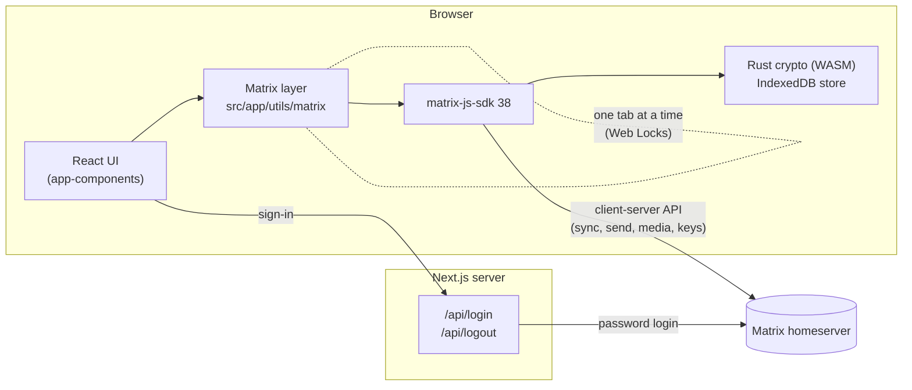

# Nexus


Nexus is an end-to-end encrypted chat client for the [Matrix](https://matrix.org) protocol, built with Next.js 14, React 18 and `matrix-js-sdk` with its Rust crypto engine.

| Light | Dark |
|---|---|
|  |  |

## Highlights

- **End-to-end encryption** with the Rust crypto engine (`initRustCrypto`): encrypted rooms and attachments, emoji device verification, recovery keys and server-side key backup.
- **A full chat experience:** threads, replies, edits, reactions, deletion, date separators, infinite history, and image, audio, video and file attachments.
- **Room management:** create public or private rooms, join by name, alias or ID, invite people, and manage roles, kicks, bans, privacy and encryption.
- **Resilient sessions:** SDK-managed token refresh, start-up that survives a flaky network, clean sign-out that revokes the session, and a single-tab guard that keeps two tabs from corrupting the crypto store.
- **Accessible:** usable with the keyboard alone, with axe-core WCAG 2.1 A/AA scans of the sign-in page and the chat screen in both themes in CI (colour contrast is a design decision and not enforced).
- **Tested in depth:** 777 unit and component tests and 206 end-to-end tests. The E2E tests run the real SDK against a fake Matrix homeserver that answers through Playwright's request interception.

See [`TESTING.md`](TESTING.md) for the test strategy and [`CHANGELOG.md`](CHANGELOG.md) for the full list of changes.

## Architecture



- **`src/app/utils/matrix/`** owns the client lifecycle: start-up and retry (`client.ts`), the stored session and per-account crypto stores (`session.ts`, `crypto.ts`), recovery keys and key backup (`recovery.ts`, `storage.ts`), verification (`verification.ts`), device checks (`devices.ts`), power-level rules (`permissions.ts`) and the single-tab lock (`tabLock.ts`). Components import it through the `src/app/utils/matrix.ts` barrel.
- **`src/app/app-components/timeline/`** derives the chat view from the SDK's own timeline on every change (`model.ts`, `useRoomTimeline.ts`), so edits, redactions, relations and send status follow the SDK's rules. It also caches decrypted media behind revocable object URLs with an allow-listed type (`useMediaCache.ts`).
- **`src/app/api/`** proxies password login and logout through the Next.js server, validating the homeserver's replies.

## Getting started

Requirements: Node.js 18 or later, and a Matrix account on any homeserver (matrix.org works).

```bash
npm install
cp .env.example .env   # point both variables at your homeserver if it isn't matrix.org
npm run dev
```

Open [http://localhost:3000](http://localhost:3000) and sign in with your Matrix username and password.

| Variable | Purpose |
|---|---|
| `MATRIX_HOMESERVER` | The homeserver the server-side `/api/login` and `/api/logout` routes call. After sign-in, the browser talks to the base URL the login route reports: the homeserver's own `well_known` client URL when its login reply names one, and this URL otherwise. |
| `NEXT_PUBLIC_MATRIX_HOMESERVER` | Fallback for `MATRIX_HOMESERVER` when that one isn't set. |

## Scripts

| Command | What it does |
|---|---|
| `npm run dev` | Development server on port 3000 |
| `npm run build` / `npm start` | Production build and server |
| `npm run lint` / `npm run typecheck` | ESLint and TypeScript checks |
| `npm test` / `npm run test:coverage` | Unit and component tests (Vitest), with coverage thresholds |
| `npm run test:e2e` | Builds the app and runs every Playwright spec against it |
| `npm run test:e2e:smoke` | The critical journeys only |
| `npm run test:e2e:regression` | The edge cases and failure paths beyond the critical journeys |
| `npm run test:e2e:a11y` | WCAG 2.1 AA scans in light and dark mode |
| `npm run verify` | Everything CI runs: lint, type check, unit and E2E |

## Testing

| Level | Tool | Tests |
|---|---|---|
| Unit | Vitest | 422 |
| Component | Vitest + Testing Library | 355 |
| End-to-end | Playwright on a production build | 206 |

The E2E suite needs no Matrix server. `tests/e2e/support/homeserver.ts` is a stateful fake homeserver that answers the browser's requests through Playwright's `page.route`, running in the test process, with sync (including gappy syncs), history, media, key backup, signed device keys, refresh tokens and fault injection. It lets the real app, SDK and Rust crypto run end to end in every test, with no network and full control over timing and failures. Details are in [`TESTING.md`](TESTING.md).

## Project structure

```
src/
├── app/
│   ├── api/login, api/logout     # Server-side login and logout proxies
│   ├── app-components/           # Chat UI: header, room list, chat window, composer, overlays
│   │   └── timeline/             # Timeline model, room timeline hook, media cache, reaction picker
│   ├── auth/page.tsx             # Sign-in page
│   ├── utils/
│   │   ├── matrix/               # Matrix client lifecycle, crypto, recovery, verification, permissions, tab lock
│   │   ├── matrix.ts             # Public API of the Matrix layer
│   │   └── dates.ts, media.ts, upload.ts, image-upload.ts, keyboard.ts, helpers.ts
│   ├── client-init.tsx           # Starts the client for the stored session
│   ├── layout.tsx, page.tsx      # App shell and chat page
│   └── globals.css
├── components/ui/                # shadcn/ui primitives
└── lib/utils.ts

tests/
├── setup.ts                      # jsdom setup shared by unit and component tests
├── unit/                         # Vitest: matrix/, timeline/, utils/, api/, components/, support/
└── e2e/                          # Playwright specs by feature
    └── support/                  # Fake homeserver, page object, fixtures, image and theme helpers

docs/
└── images/                       # README screenshots
```

## Security notes

- Access and refresh tokens, the device ID and the crypto-store passphrase live in `localStorage`, scoped to the signed-in account. **Logout** revokes the session on the server and removes all of them, together with the account's IndexedDB crypto store. **Forget this session** also wipes every account's Matrix data from the browser.
- A recovery key is remembered in `localStorage` only after it has been checked against the account's secret storage, so it can unlock key backup on later visits. Logout removes it.
- Attachments are shown from `blob:` URLs whose media type comes from an allow-list, so a received file can never run as a page on the app's origin.

## License

MIT